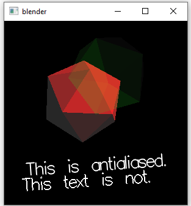

# A1 Report

Author: Thomas Ingram 

Date: 2023-09-16 

Check [readme.txt](readme.txt) for course work statement and self-evaluation. 
  
## Q1 Concepts of raster graphics (short answer)
### Q1.1 frame buffer
The framebuffer is a specifically allocated block of graphics memory to hold the graphics data of image raster patterns in a raster graphic system. 

### Q1.2 pixel
A pixel, or picture element, is a raster pattern element that corresponds to both a dot on the raster display and in the framebuffer.

### Q1.3 color depth
The colour depth is the number of bits that corresponds to a single pixel within the memory space of the framebuffer, it can vary between 1,8,16, or 24 bits. 
### Q1.4 resolution
Resolution is the number of pixels in the raster display and by extension in the frame buffer, it is normally represented by the amount of pixels in a row multipliedby the amount of rows.

## Q2 Concepts of raster display (short answer)
### Q2.1 scan line
A scanline is a row of pixels in a raster display.
### Q2.2 refreshment & refresh rate
refreshment is the process of redrawing a full scanline of pixels on the raster display, refresment of the entire raster display is normally done with various patterns to decrease and eliminate flicker.

the refresh rate or frequency is the rate at which the display refreshes and displays frames normally counted in frames per second.. 
### Q2.3 frame
A frame refers to a full scan of an image/raster pattern on the screen, it is normally stored then displayed in the frame buffer.

## Q3 Roles of CPU and GPU in CG (short answer)
### Q3.1 CPU roles
the CPU in CG is reponsible for model computing and communicating information such as the graphic object model data (verticies) to the video memory as well as the instructions to the GPU.
### Q3.2 GPU roles
GPU is a separate, self-contained computing device dedicated for graphics computing, the GPU processes object data, generates pixel data and stores the pixel data in the framebuffer. it is generally responsible for any and all rendering computing.

## Q4 C/C++ OpenGL programming environment (lab practice)
### Q4.1 C/C++ OpenGL installation 
Yes

### Q4.2 OpenGL C project 
Yes

### Q4.3 OpenGL C++ project 
Yes

**References**

1. CP411 a1
2. [blender.c](https://bohr.wlu.ca/hfan/cp411/examples/mk/blender.c)
3. [glut_test.cpp](https://bohr.wlu.ca/hfan/cp411/examples/glut_test.cpp)
