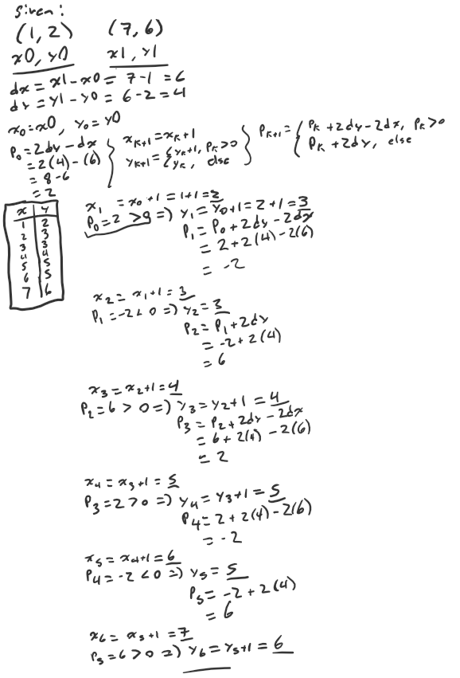
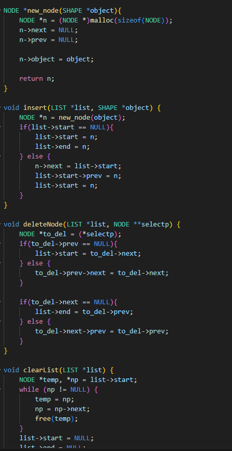

# A2 Report

Author: Thomas Ingram 

Date: 2023-10-03

Check [readme.txt](readme.txt) for course work statement and self-evaluation. 
  
## Q1 Graphics pipeline (description)

### Q1.1 Coordinate systems & transformations

What coordinate systems and transformations are involved in graphics pipeline?

A:the coordinate systems involved are:
- Modeling Coordinate System (MCS)
- World Coordinate System (WCS)
- View Coordinate System (VCS)
- Normalized Device Coordinate System (NDCS)
- Device Coordinate System or Screen Coordinate System (DCS or SCS)

the transformations involved are as follows:
- Modeling Transforms (MCS to WCS)
- Viewing Transforms (WCS to VCS)
- Projection Transforms (VCS to NDCS)
- Display Transforms (NDCS to DCS/SCS)

### Q1.2 Primitives

What are graphic primitives, and their relations to graphics objects?

A:Graphic primitives are the basic shapes that are directly supported by the hardware.

the primitives are:
- Points
- Line Segments
- Polygons
	- can be decomposed to triangles

graphics objects are made/defined by the collection of graphics primitives they are made up of. 

### Q1.3 Scan conversion

What does a scan conversion algorithm do?

Scan conversion algorithms convert primitives to pixels in the last step of the graphics pipeline and render the primitives to the frame buffer.

### Q1.4 Hand-on Bresenham algorithm

Apply Bresenham algorithm to determine the pixel positions of line segment from (1, 2) to (7, 6). Write you answer on paper, take a picture, and insert the picture here.

## Q2 OpenGL and Glut (lab practice)

### Q2.1 OpenGL primitives 

Yes

{width=90%}

### Q2.2 Interactive graphics 

Yes

{width=90%}

### Q2.3 Bitmap file I/O 

Yes

{width=90%}

## Q3 SimpleDraw (programming)

### Q3.1 Display window and menu

Yes

{width=90%}

### Q3.2 Data structures

Yes

{width=90%}

### Q3.3 Draw rectangles

Yes

{width=90%}

### Q3.4 Draw circles

Yes

{width=90%}

### Q3.5 Edit features

No, no time

### Q3.6 Save/Open SVG files

No, no time

### Q3.7 Export to bitmap

No, no time

### Q3.8 Circle&Square artwork

No, no time

**References**

1. CP411 a2
2. Add your references if you used any. 
