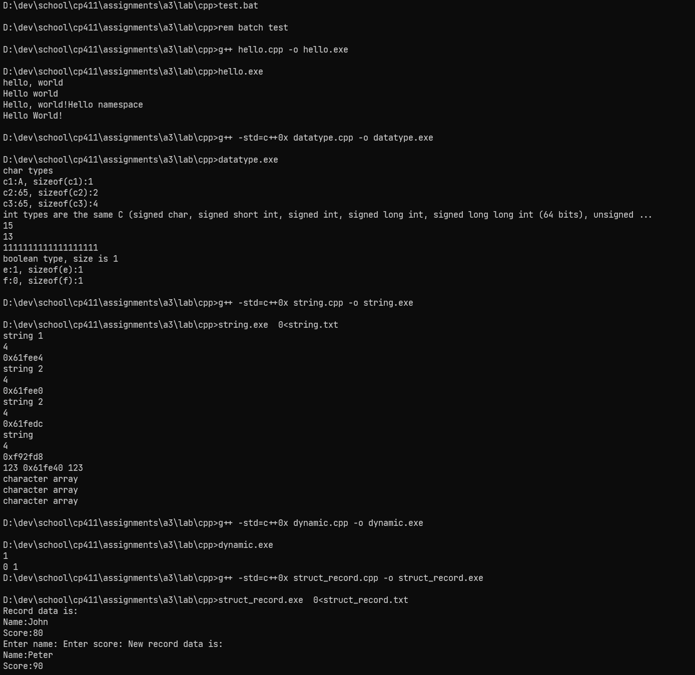
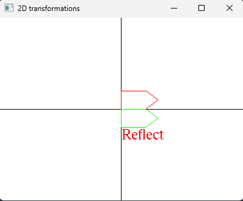
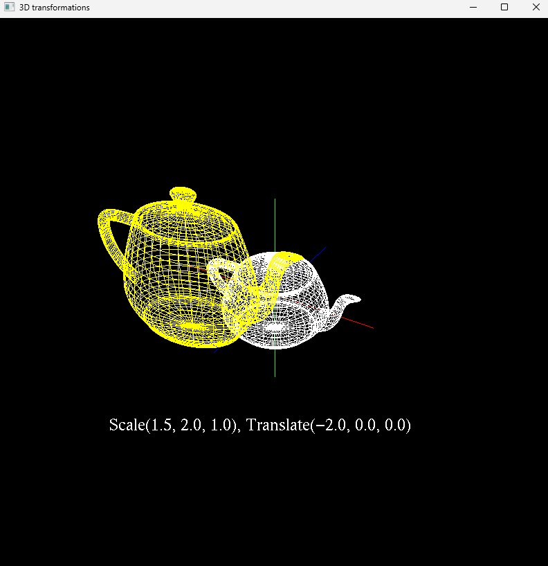
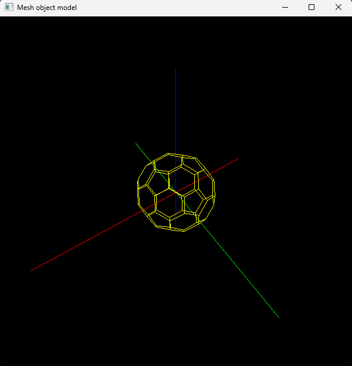

# A3 Report

Author: Thomas Ingram 

Date: 2023/10/25 

Check [readme.txt](readme.txt) for course work statement and self-evaluation. 
  
## Q1 Graphics transformations (short_answer)

### Q1.1 Principle of transformations

### 1) What are the three basic transformations?

A:The three basic transformations are Translations, Scaling, and Rotations.

### 2) What is a composite transformation?

A: A composite transformation is a transformation performed on an object that consists of a sequence of the basic transformations.

### 3)Briefly describe why Homogeneous coordinate system is used in transformation computing.

A:The Homogeneous coordinate system is used in transformation computing because it allows us to treat all 3 different basic transformations in a consistent way. this is because it allows their matrix representations to be the same size and thus combinable. 

### Q1.2 Hand on 2D transformations

## Q2 Graphics transformation programming (lab practice)

### Q2.1 Warm up C++ 
Complete? Yes

{width=90%}

### Q2.2 2D transformations 
Complete? Yes

{width=90%}

### Q2.3 3D object and transformations 
Complete? Yes

{width=90%}

### Q2.4 Mesh object model 
Complete? Yes

{width=90%}

## Q3 SimpleView1 - transformations (programming)

### Q3.1 Create and render cube objects 

Complete? (Yes/No) 

If Yes, insert a screen shot image to show the completion.

[image caption](images/demo.png){width=90%}

If No, add a short description to describe the issues encountered.

### Q3.2 Create and render the pyramid object 

Complete? (Yes/No) 

If Yes, insert a screen shot image to show the completion.

[image caption](images/demo.png){width=90%}

If No, add a short description to describe the issues encountered.

### Q3.3 Create and render the house object 

Complete? (Yes/No) 

If Yes, insert a screen shot image to show the completion.

[image caption](images/demo.png){width=90%}

If No, add a short description to describe the issues encountered.

### Q3.4 MCS transforms 

Complete? (Yes/No) 

If Yes, insert a screen shot image to show the completion.

[image caption](images/demo.png){width=90%}

If No, add a short description to describe the issues encountered.

### Q3.5 WCS transforms 

Complete? (Yes/No) 

If Yes, insert a screen shot image to show the completion.

[image caption](images/demo.png){width=90%}

If No, add a short description to describe the issues encountered.

### Q3.6 VCS transforms 

Complete? (Yes/No) 

If Yes, insert a screen shot image to show the completion.

[image caption](images/demo.png){width=90%}

If No, add a short description to describe the issues encountered.

**References**

1. CP411 a3
2. Add your references if you used any. 
