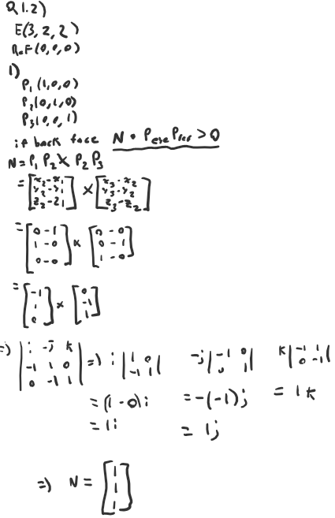
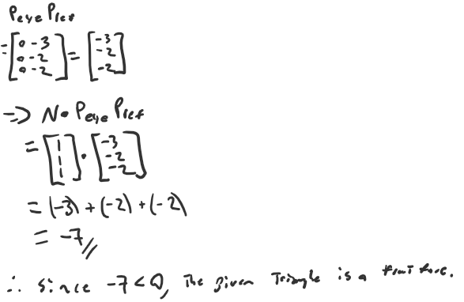
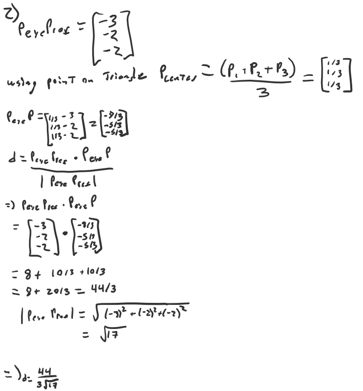
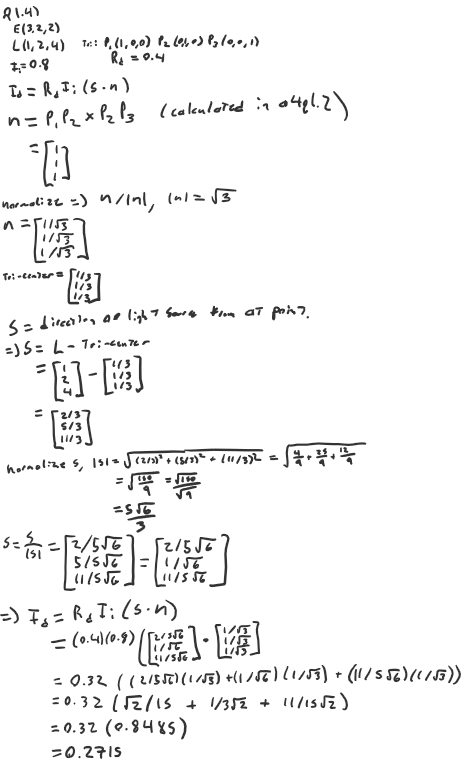
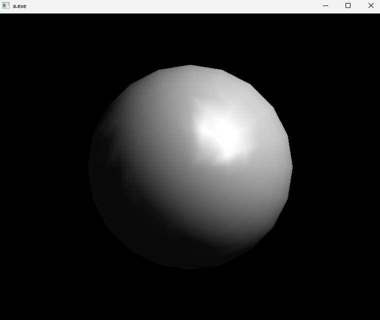
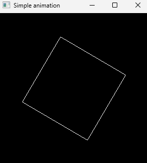
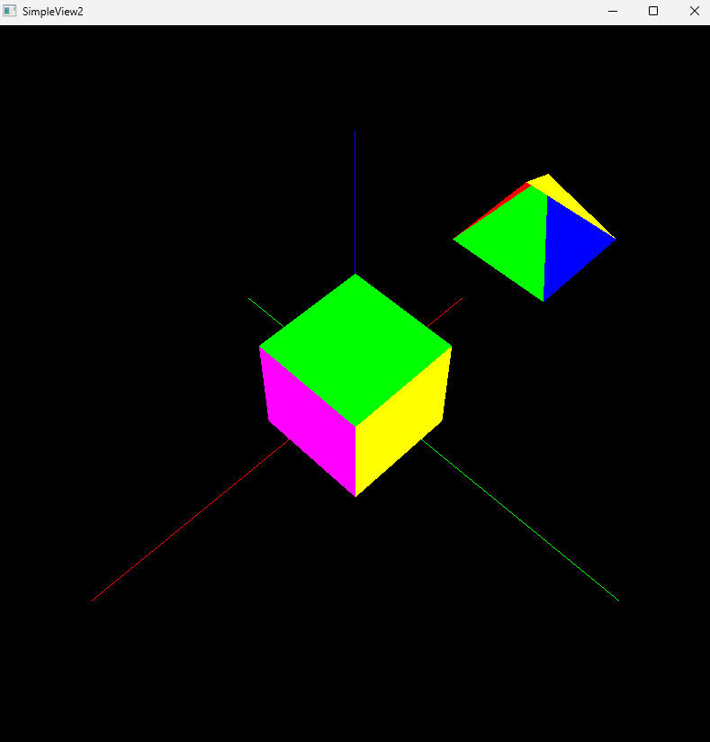
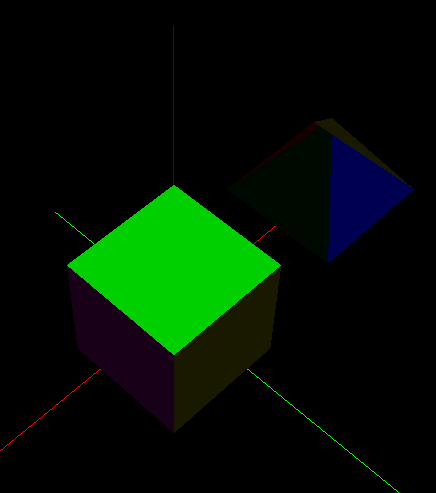
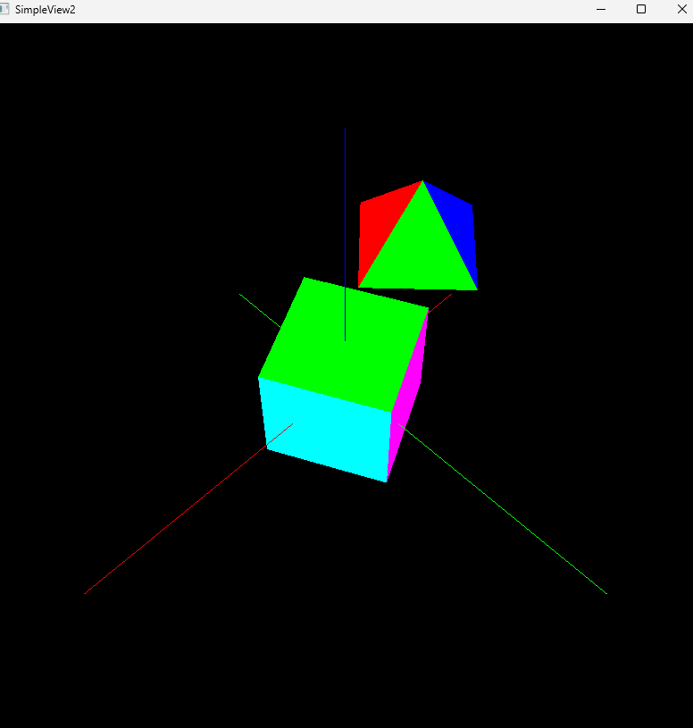

# A4 Report

Author: Thomas Ingram 

Date: 2023/11/06

Check [readme.txt](readme.txt) for course work statement and self-evaluation. 
  
## Q1 Culling, Lighting, Shading (description)

### Q1.1 Concepts of culling

1) What is the difference between culling and clipping?

A: culling removes or modifies primitives hidden in whole or part by other primitives whereas clipping removes or modifies primitives not within the viewing portion.

2) What is the difference between object precision and image precision hidden surface removal methods? Give an example of each method.

A: the difference between object precision and image precision lies in the level of detail/granularity the method is considering when making decisions. Object Precision methods like Painter's Algorithm usually require mainainting a sorted list of entire objects and their depths. Whereas image precision methods like Depth/Z Buffering only deal with individual pixels and determines visibility based purely on the depth at that point.

### Q1.2 Culling computing

Given:

    eye position at E(3, 2, 2), and
    reference (look at) point at R(0, 0, 0).

1) Compute to determine if triangle P1(1,0,0)P2(0,1,0)P3(0, 0, 1) is a back face.
2) Compute the depth (z-value) of the above triangle.

{width=90%}
{width=90%}
{width=90%}

### Q1.3 Concepts of lighting and shading

1) What does a light source model determine? Give the names of three light source models.

A:A light source model represents the light source direction/position, color and intensity in a 3d scene. the three light source models are: Point where light comes form a point, Directional where light comes from a direction and, Ambient where light comes from anywhere.

2) What does a reflection model determine? Give the names of three reflection models.

A:A reflection model determines how light interacts with the surfaces of objects and how it is reflected by the surface. three reflection models are: Diffuse reflection, Specular reflection, Ambient reflection

3) What does a shading model determine? Give the names of three shading models.

A:A shading model defines how a pixel color is calculated based on the light reflection models three basic shading models are: Constant Shading, Gouraud Shading, Phong Shading

### Q1.4 Lighting computing

Given:
- eye position at E(3, 2, 2), point light position at L(1, 2, 4) with light intensity 0.8,
- triangle P1(1,0,0)P2(0,1,0)P3(0, 0, 1), and surface diffusion rate 0.4 for red color.

Compute the simple diffusion reflection intensity of red color at the center of the triangle. Use the simple diffusion reflection formula in slide 11 of lecture 13 (lighting).

{width=90%}

## Q2 OpenGL Culling, Lighting, Shading (lab practice)

### Q2.1 Hidden surface removal 

Complete? Yes

{width=90%}

{width=90%}

### Q2.2 Lighting and shading 

Complete? Yes

{width=90%}

{width=90%}

{width=90%}

{width=90%}

### Q2.3 Animation 

Complete? Yes 

{width=90%}

## Q3 SimpleView2 Culling, Lighting, Shading (programming)

### Q3.1 Culling

Complete? Yes

{width=90%}

### Q3.2 Lighting

Complete? Yes

{width=90%}

### Q3.3 Shading

Complete? Yes

{width=90%}

it doesnt affect all faces perfectly

### Q3.4 Animations

Complete? No

{width=90%}

i implemented the spin of a single object but I couldnt implement the solar system because for some reason whenever I would add the house object to the world it would crash, I implemented sun and earth but since I couldnt use the house object I couldnt get the 3rd planet.

**References**

1. CP411 a4
2. Add your references if you used any. 
