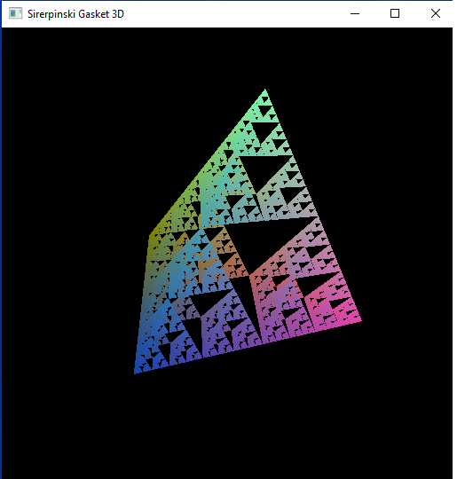

## Hand on Fractal computing by GLSL

### About

This glsl_fractal project contain examples of  fractal computing using GLSL. 

Examples are from Interactive Computer Graphics: A Top-Down Approach with Shader-Based OpenGL (6th Edition) Edward Angel (Author), Dave Shreiner (Author)

It contains the following examples

1. julia_bitmap.cpp : Julia set, dispaly by openGL bitmap
2. julia_texture.cpp : Julia set, dispaly by openGL texture   
3. koch_curve.cpp : koch curve
4. landscape.cpp : middle point 
5. mandelbrot.cpp : Mandelbrot set
6. sierpinski_iterate.cpp  : sierpinski gasket generate by iterations 
7. sierpinski_ran.cpp  :  fsierpinski gasket generate by random approach 
8. sirerpinski_gasket_3d.cpp : 3D sierpinski gasket

### Testing
 
Import the glsl_fractal.zip as existing Eclipse project archive. 
 
All *.cpp programs are commented out. To test run a particular program, just uncomment the code (open file, select all Ctrl+A, Ctrl + / ), compile and run. 

For example, test 3D Sirerpinski gasket, open file sirerpinski_gasket_3d.cpp, uncomment all lines. Compile and run. 

Commend out the current one (select all, Ctrl+A, Ctrl+/ ), and move to next example. 

Comment out version micro in the shader programs. //#version 150
