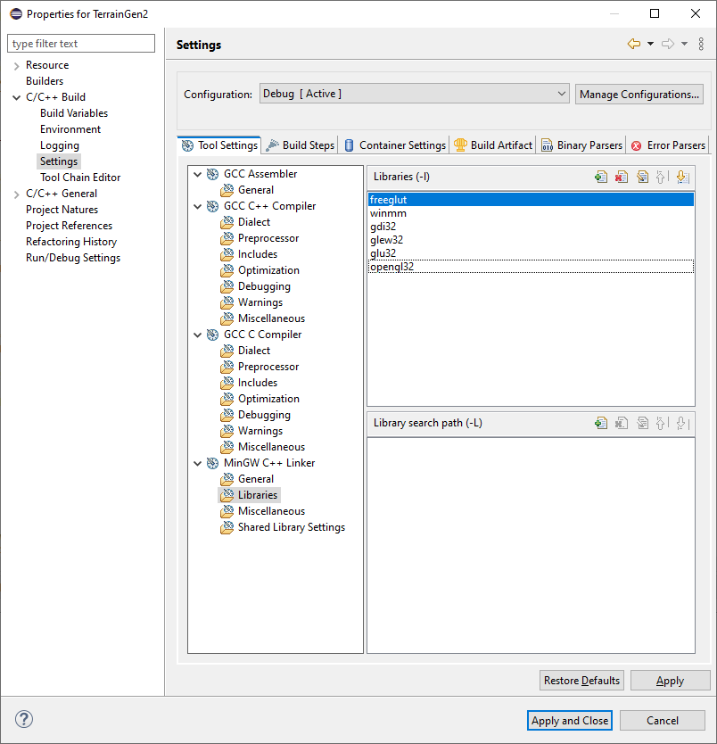

# Procedural Terrain Generation CP411 Graphics Project

this project creates a 3D world that the user can explore by flying around and seeing a world generated entirely by perlin noise!

Made by Thomas Ingram and Ben Cooney.

{width=90%}

## Controls
W - Fly forward in the direction the camera is pointing

S - Fly Backwards in the opposite direction the camera is pointing.

Left Click **and** Drag - Pans the camera 

Right Click - Brings up the menu

### Menu
The menu for our project allows the user to:

- Generate a random new world and explore that (sets a new seed for the procedural generation).

- Quit the program.

## Running the Project
to compile and run the project it is quite easy.

Navigate to the `/TerrainGeneration` folder and run the following command:

```
g++ *.cpp *.hpp *.h -lopengl32 -lglu32 -lfreeglut -o terrain.exe
```

this will create an executable file terrain.exe, make sure you have the texture files (grass.bmp, rock.bmp, snow.bmp) under the "textures" folder in the same spot as the "terrain.exe" executable.

**NOTE**: this is not an eclipse project thus it is not preconfigured to run/build as an eclipse project,  use the command defined above to build and run.

### Eclipse Compatability
if any issues arise in eclipse copy paste all files to a new C++ project and make sure libraries below are set

{width=90%}

## Design/Important Files

### World (cpp/hpp)
handles all world specific logic and configuration (seed/render distance). Most important part is the handling of chunk/heightmap memory (creation and deletion).

### Chunk (cpp/hpp)
logic and implementation of a chunk, includes heightmap construction logic in addition to logic surrounding the translation between chunk coordinates and world coordainte systems.

### Camera.hpp
a data structure to handle and store camera configuration information.

### Textures.hpp
contains method and logic behind loading bitmaps used for textures

### FastNoise.h
contains logic for implementing our perlin noise used for generation of the heightmap.

code borrowed from (https://github.com/Auburn/FastNoiseLite) 