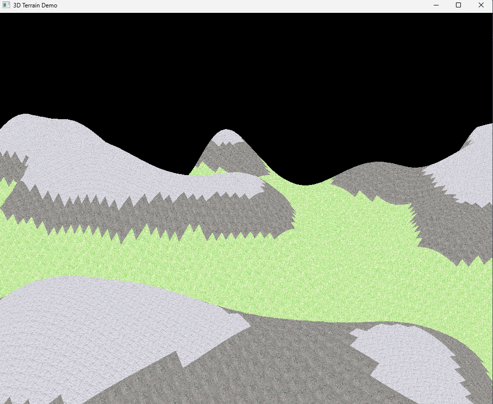

# Procedural Terrain Generation CP411 Graphics Project Report

Author: Thomas Ingram 

Date: 2023-12-05 

Check [readme.txt](readme.txt) for course work statement and self-evaluation. 
  

## R1 Proposal (proposal)

### R1.1 Application problem description
 

Complete? Yes

	

### R1.2 Creativity/new features
 

Complete? Yes

- implemented free camera movement and rotating in 3d world
- chunk based procedural generation for efficient computation and memeory storage.
- depth testing, alpha testing, and polygon offset to enhance the rendering of 3D scenes

### R1.3 Design consideration
 

Complete? Yes

see proposal

### R1.4 Milestones and schedule
 

Complete? Yes

see proposal

### R1.5 References
 

Complete? Yes

see proposal

### R1.6 Writing of the proposal
 

Complete? Yes 

see proposal

## R2 Design & implementation (programming)

### R2.1 Problem solving and algorithms
 

Complete? Yes

{width=90%}

### R2.2 Completion of the project
 

Complete? Yes

{width=90%}

### R2.3 New features
 

Complete? Yes

{width=90%}

### R2.4 Program design and organization
 

Complete? Yes

utilized data oriented design to efficiently work with data and generate the world. abstracted out large self contained functionality (Noise).

{width=90%}

## R3 Delivery (document)

### R3.1 Presentation & demonstration
 

Complete? Yes 
- presented in class and included demo video

### R3.2 Documentation
 

Complete? Yes

	

### R3.3 Submission packaging
 

Complete? Yes

This package.

**References**

1. CP411 project
2. https://en.wikipedia.org/wiki/Procedural_generation
3. http://www.fdg2015.org/papers/fdg2015_paper_19.pdf 
4. https://www.gamedeveloper.com/design/how-to-effectively-use-procedural-generation-in-games
5. https://github.com/Auburn/FastNoiseLite
